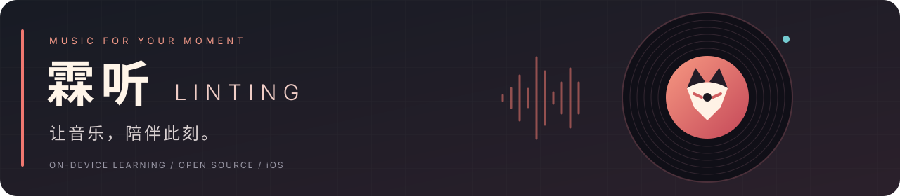
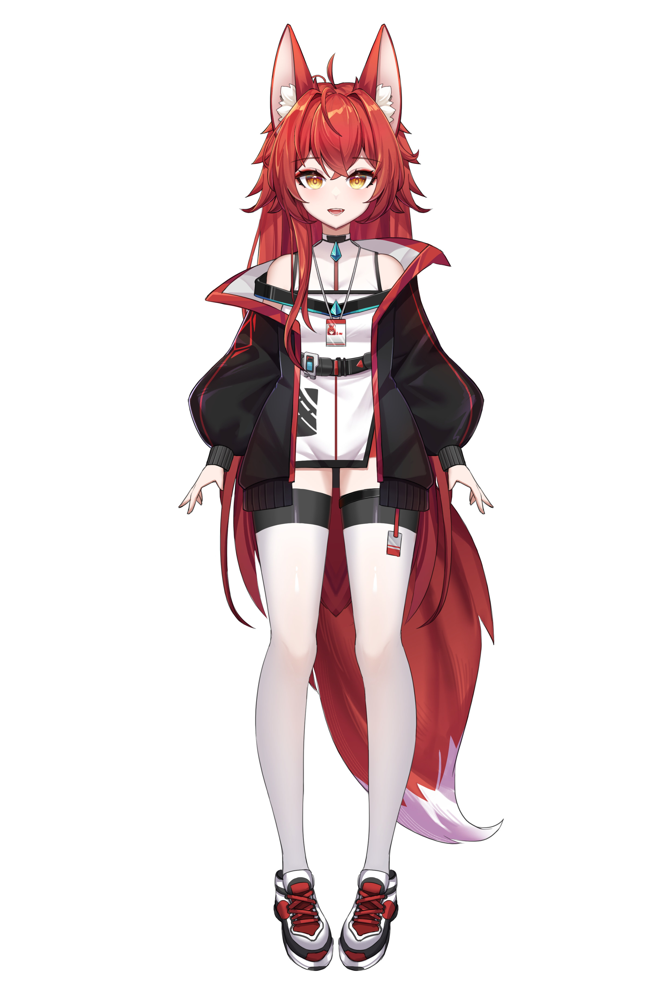
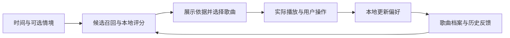

<p align="center">
  
</p>

<p align="center">
  <a href="docs/BUILD.md"></a>
  
  
  <a href="LICENSE"></a>
</p>

<p align="center">
  <a href="docs/BUILD.md">开始使用</a> ·
  <a href="docs/ARCHITECTURE.md">算法与架构</a> ·
  <a href="docs/PRIVACY.md">数据与隐私</a> ·
  <a href="CONTRIBUTING.md">参与改进</a>
</p>

<table>
<tr>
<td width="64%" valign="middle">

### 下一首，从你的此刻开始。

**霖听**是一款在 iPhone 上逐渐学习个人听歌偏好的音乐播放器。

从时间、你选择分享的场景，到一次喜欢、一次跳过、一次主动点播——把这些线索留给下一首，也把推荐的依据展示给你。

**随此刻听**　结合情境与真实反馈选曲。  
**随自己选**　搜索歌曲，打开网易云歌单。  
**知道为什么**　看见加分、扣分和候选概率。

<sub>个人实验项目 · 无需自建后端 · 音乐服务需要联网</sub>

</td>
<td width="36%" align="center">
  <br />
  <sub>霖伊 · 陪你听见此刻</sub>
</td>
</tr>
</table>

## 一首歌之外，发生了什么

| 🎧 听得顺手 | 🧭 理解此刻 |
| :--- | :--- |
| 提前准备候选与播放地址；学习数据在后台增量写入，减少交互等待。 | 可选的时间、健康摘要与「家 / 学校 / 路上」等地点线索，参与本地选曲。 |
| 搜索与个人歌单支持直接点播，点播后的真实反馈继续进入学习。 | 主动选择照片后，用云端模型联合近期图片、时间和你的描述，形成可纠正的听歌意图假设。 |

| 📊 推荐说得清 | 🎵 歌曲有依据 |
| :--- | :--- |
| 展示每项分数贡献，跳过风险明确扣分；候选抽样概率与总分分开解释。 | BPM 在本地分析音频前、中、后多个片段，记录覆盖与置信度。 |
| 区分喜欢、完播、跳过、重听与「现在不合适」，避免把每个动作都当成永久偏好。 | 歌曲封面复用于播放器和系统「正在播放」；可选云端歌词分析逐步积累歌曲档案。 |

## 为什么是这首

霖听采用四个在线学习头。它们输出的是**不同方向的倾向值**，彼此可以相关，不是四个相加等于 100% 的概率。

```text
排序分 = 其他已记录的排序项
       + 2.4 × 接受倾向
       − 3.0 × 拒绝倾向    ← 风险越高，扣分越多
       + 2.0 × 亲近偏好
       + 1.5 × 主动再选倾向
       − 1.45             ← 中性基线校正
```

排序后，使用 softmax 与少量均匀探索选择候选。**总分是相对排序值，不是「你会喜欢它的概率」。** 权重是当前实现中的人工设定，仍需验证和改进。



查看 [算法细节与代码入口 →](docs/ARCHITECTURE.md)

## 在自己的 iPhone 上运行

1. 克隆仓库，用 Xcode 打开 `ios/BGMPrototype.xcodeproj`。
2. 为 `BGMPrototype` target 选择自己的签名团队和唯一的 Bundle Identifier，确认 HealthKit 能力可用。
3. 连接 iOS 17 或更新版本的 iPhone，选择设备并运行。
4. 在 App 内登录自己的网易云账号。若需要云端照片 / 歌词分析，再填写自己的**阿里百炼北京地域 API Key**。

```bash
git clone https://github.com/Luase233/linting.git
cd linting
open ios/BGMPrototype.xcodeproj
```

当前发布的是 **1.3（build 5）源码**，不附带签名安装包、账号、API Key 或音乐文件。完整构建步骤、无签名检查和测试命令见 [运行指南](docs/BUILD.md)。

## 数据留在哪里

| 内容 | 处理方式 |
| :--- | :--- |
| 听歌反馈、模型参数、推荐快照 | 本机 SQLite 与应用存储，用于个人学习 |
| 健康数据 | 用户授权后在设备上形成摘要，不发送给云端模型 |
| 精确位置与自定义地点坐标 | 本机匹配；云端照片分析仅接收可选的语义地点标签与时间 |
| 主动选择的照片 | 去除元数据后发往阿里云；默认近期图片缓存最多 5 张 / 24 小时，按应用清理时机过期清除 |
| 网易云会话、阿里 API Key | 保存在本机 Keychain；音乐请求仍需发送账号会话给网易云 |

照片分析也会发送照片时间、近期场景摘要，以及你填写的说明或感受。不要在说明中填入不想分享的个人信息。照片中的可见内容本身仍可能包含敏感信息；去除元数据不等于内容匿名化。

云端分析按 App 内记账共用 **每天 ¥1 / 累计 ¥8** 的预算。它不是阿里云账户级扣费上限；模型版本、可用性和计费规则以服务商为准。[完整数据说明 →](docs/PRIVACY.md)

## 项目地图

```text
ios/
  BGMPrototype.xcodeproj/   Xcode 工程
  BGMPrototype/Sources/    播放、推荐、场景、存储与界面
  BGMPrototype/Assets.xcassets/
  Tests/                  Swift 行为检查
docs/
  assets/                 GitHub 首页视觉素材
  ARCHITECTURE.md          算法与模块说明
  BUILD.md                构建与验证
  PRIVACY.md              数据流与边界
```

## 仍在成长

这是持续迭代的个人项目，不是经过大规模验证的推荐系统。网络、音乐服务接口与账号权限会影响播放；音频 BPM 也可能受到变速、弱节拍和半拍 / 双拍歧义影响。照片只提供场景线索与意图假设，不能据此确认一个人的心理状态。

欢迎提交可复现的问题、算法讨论和改进。[贡献方式 →](CONTRIBUTING.md)

---

代码采用 [MIT License](LICENSE)。霖伊角色插画、应用图标等美术素材**不包含在代码的 MIT 授权中**，参见 [素材说明](ARTWORK.md)。坐标转换相关第三方声明保留在 [ThirdPartyNotices.txt](ios/BGMPrototype/ThirdPartyNotices.txt)。

<p align="center"><sub>霖听 LINTING · 把下一首，交给此刻。</sub></p>
